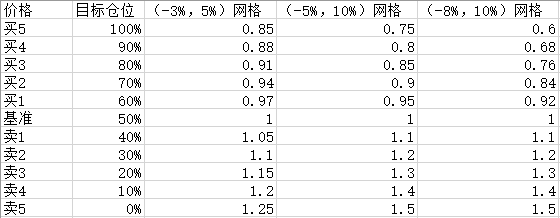
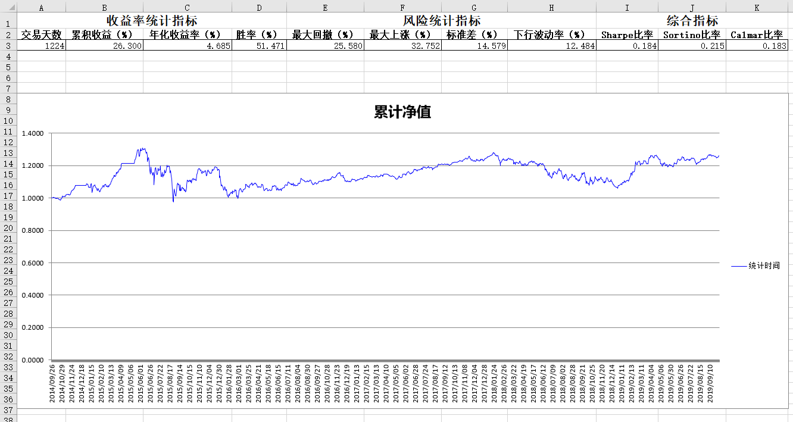

# 网格交易CTA策略

#### 1.网格交易法介绍

​	根据笔者对于网格策略的粗略了解，在具有多空交易的市场中，网格策略主要可以分为三种：做多、做空、和中性，而在只能做多的股票市场中，就只能使用做多的网格策略了。这里先简单说明一下只做多的网格策略的具体交易规则：首先决定网格格数，以及上涨与下跌时每格相比入场价格的涨跌幅，然后选择合适的入场价格入场做多或买入50%可用资金，当价格上涨或下跌超过一网格的涨跌幅后，仓位也随之变化，每上涨一格卖出一份头寸，每下跌一格买入一份头寸，具体交易规则可以参考下图：




​	如果是做空版本的网格策略，交易规则正好与上文所述的做多版本的网格策略相反：在入场价格做空50%的资金，价格每上涨一格则增加一份做空资金，每下跌一格则平仓一份做空资金。而中性版本的网格策略，则没有开始时50%资金的底仓，每上涨一格则做空一份资金，每下跌一格则做多一份资金。

​	下文将详述在wtpy上实现一个只做多的网格策略的编写过程。

#### 2.策略实现

​	了解了策略的交易逻辑和算法以后，我们首先要确定策略需要的参数，其中一部分是cta策略常用的固定参数，另一部分是网格策略需要的固定以及可变参数。

- 参数说明

```python
		self.__short_days__ = short_days  # 计算短时均线时使用的天数
        self.__long_days__ = long_days  # 计算长时均线时使用的天数
        self.__num__ = num  # 单边网格格数
        self.__p1__ = p1    # 上涨时每格相比基准格的涨幅
        self.__p2__ = p2    # 下跌时每格相比基准格的跌幅(<0)
        self.__period__ = period    # 交易k线的时间级，如5分钟，1分钟
        self.__bar_cnt__ = barCnt   # 拉取的bar的次数
        self.__code__ = code 		# 策略实例名称
        self.__capital__ = capital  # 起始资金
        self.__margin_rate__ = margin_rate  # 保证金率
        self.__stop_loss__ = stop_loss  # 止损系数，止损点算法为网格最低格的价格*stop_loss
```

​	参数中的短时均线和长时均线用于判断策略进场的基准价格，当短时均线上穿长时均线且没有仓位时会以当前价格作为基准价格进场。

- 策略框架介绍

```python
class BaseCtaStrategy:
    '''
    CTA策略基础类，所有的策略都从该类派生\n
    包含了策略的基本开发框架
    '''
    def __init__(self, name):
        self.__name__ = name

    def on_init(self, context:CtaContext):
        '''
        策略初始化，启动的时候调用\n
        用于加载自定义数据\n
        @context    策略运行上下文
        '''
        return
        
    def on_calculate(self, context:Context):
        '''
        策略主调函数，所有的计算逻辑都在这里完成
        '''
        return
```

**策略实现具体思路：**

第一步，根据交易品种的特点选择合适的参数·如：网格格数5。上涨时每格涨幅0.03、下跌时每格跌幅-0.02，短均线天数5，长均线天数10；

第二步，根据上一步中所选的参数，生成包含网格交易每格的边界以及每格的持仓比例的两个列表；

第三步，读取当前价格与仓位，与第二部中所算出的两个列表进行对照，获得交易之后所要达到的仓位比例，也就是目标仓位，然后计算得出达到目标仓位所需交易的手数并进行相应的操作。

第二步中创建的两个list示例如图：


- 最终完整策略代码如下

```python
from wtpy import BaseCtaStrategy
from wtpy import CtaContext
import numpy as np
import math


class GridStra(BaseCtaStrategy):
    
    def __init__(self, name:str, code:str, barCnt:int, period:str, short_days:int, long_days:int, num:int, p1:float, p2:float, capital, margin_rate= 0.1,stop_loss = 0.8):
        BaseCtaStrategy.__init__(self, name)

        self.__short_days__ = short_days  # 计算短时均线时使用的天数
        self.__long_days__ = long_days  # 计算长时均线时使用的天数
        self.__num__ = num  # 单边网格格数
        self.__p1__ = p1    # 上涨时每格相比基准格的涨幅
        self.__p2__ = p2    # 下跌时每格相比基准格的跌幅(<0)
        self.__period__ = period    # 交易k线的时间级，如5分钟，1分钟
        self.__bar_cnt__ = barCnt   # 拉取的bar的次数
        self.__code__ = code        # 策略实例名称
        self.__capital__ = capital  # 起始资金
        self.__margin_rate__ = margin_rate  # 保证金率
        self.__stop_loss__ = stop_loss  # 止损系数，止损点算法为网格最低格的价格*stop_loss


    def on_init(self, context:CtaContext):
        code = self.__code__    # 品种代码

        context.stra_get_bars(code, 'd1', self.__bar_cnt__, isMain=False)  # 在策略初始化阶段调用一次后面要拉取的K线
        context.stra_get_bars(code, self.__period__, self.__bar_cnt__, isMain=True)
        context.stra_log_text("GridStra inited")

        pInfo = context.stra_get_comminfo(code)  # 调用接口读取品类相关数据
        self.__volscale__ = pInfo.volscale
        # 生成网格交易每格的边界以及每格的持仓比例
        self.__price_list__ = [1]
        self.__position_list__ = [0.5]
        num = self.__num__
        p1 = self.__p1__
        p2 = self.__p2__
        for i in range(num):
            self.__price_list__.append(1+(i+1)*p1)
            self.__price_list__.append(1+(i+1)*p2)
            self.__position_list__.append(0.5+(i+1)*0.5/num)
            self.__position_list__.append(0.5-(i+1)*0.5/num)
        self.__price_list__.sort()
        self.__position_list__.sort(reverse=True)

        print(self.__price_list__)
        print(self.__position_list__)


    def on_calculate(self, context:CtaContext):
        code = self.__code__    #品种代码

        #把策略参数读进来，作为临时变量，方便引用
        margin_rate = self.__margin_rate__
        price_list = self.__price_list__
        position_list = self.__position_list__
        capital = self.__capital__
        volscale = self.__volscale__
        stop_loss = self.__stop_loss__
        short_days = self.__short_days__
        long_days = self.__long_days__
        theCode = code

        # 读取日线数据以计算均线的金叉
        df_bars = context.stra_get_bars(theCode, 'd1', self.__bar_cnt__, isMain=False)
        closes = df_bars.closes
        ma_short_days1 = np.average(closes[-short_days:-1])
        ma_long_days1 = np.average(closes[-long_days:-1])
        ma_short_days2 = np.average(closes[-short_days - 1:-2])
        ma_long_days2 = np.average(closes[-long_days - 1:-2])
        # 读取最近50条5分钟线
        context.stra_get_bars(theCode, self.__period__, self.__bar_cnt__, isMain=True)

        #读取当前仓位,价格
        curPos = context.stra_get_position(code)
        curPrice = context.stra_get_price(code)
        if curPos == 0:
            self.cur_money = context.stra_get_fund_data(0) + capital  # 当没有持仓时，用总盈亏加上初始资金计算出当前总资金

        trdUnit_price = volscale * curPrice * margin_rate  # 计算交易一手所选的期货所需的保证金

        if curPos == 0:
            if (ma_short_days1 > ma_long_days1) and (ma_long_days2 > ma_short_days2):  # 当前未持仓且日线金叉时作为基准价格进场
                # 做多50%资金的手数，为了不使杠杆率过高，总资金乘以一手期货的保证金率再计算手数
                context.stra_enter_long(code, math.floor(self.cur_money*margin_rate*0.5/trdUnit_price), 'enterlong')
                self.benchmark_price = context.stra_get_price(code)  # 记录进场时的基准价格
                self.grid_pos = 0.5  # 记录grid_pos表示网格当前实际仓位
                context.stra_log_text("进场基准价格%.2f" % (self.benchmark_price))  # 输出日志到终端
                return

        elif curPos != 0:
            #  当前有持仓时，先根据当前价格计算出交易后需要达到的目标仓位target_pos
            for i in range(len(price_list)-1):
                if (price_list[i] <= (curPrice / self.benchmark_price)) & ((curPrice / self.benchmark_price) < price_list[i+1]):
                    #  当前价格处于上涨或下跌区间时 仓位都应该选择靠近基准的那一端
                    if curPrice / self.benchmark_price < 1:
                        target_pos = position_list[i+1]
                    else:
                        target_pos = position_list[i]
            # 计算当价格超出网格上边界或低于网格下边界时的目标仓位
            if curPrice / self.benchmark_price < price_list[0]:
                target_pos = 1
            if curPrice / self.benchmark_price > price_list[-1]:
                target_pos = 0
                context.stra_exit_long(code, context.stra_get_position(code), 'exitlong')
                context.stra_log_text("价格超出最大上边界，全部平多")
                self.grid_pos = target_pos
            # 止损逻辑 当价格低于下边界乘以设定的stoploss比例时止损
            if curPrice / self.benchmark_price < price_list[0] * stop_loss:
                target_pos = 0
                context.stra_exit_long(code, context.stra_get_position(code), 'exitlong')
                context.stra_log_text("价格低于最大下边界*%s，止损，全部平多" % (stop_loss))
                self.grid_pos = target_pos
            # 当目标仓位大于当前实际仓位时做多
            if target_pos > self.grid_pos:
                context.stra_enter_long(code, math.floor((target_pos-self.grid_pos)*self.cur_money/trdUnit_price), 'enterlong')
                context.stra_log_text("做多%d手,目标仓位%.2f,当前仓位%.2f,当前手数%d" % (math.floor((target_pos-self.grid_pos)*self.cur_money/trdUnit_price), target_pos, self.grid_pos,\
                                                                      context.stra_get_position(code)))
                self.grid_pos = target_pos
                return
            # 当目标仓位小于当前实际仓位时平多
            elif target_pos < self.grid_pos:
                context.stra_exit_long(code, math.floor((self.grid_pos-target_pos)*self.cur_money/trdUnit_price), 'exitlong')
                context.stra_log_text("平多%d手,目标仓位%.2f,当前仓位%.2f,当前手数%d" % (math.floor((self.grid_pos-target_pos)*self.cur_money/trdUnit_price), target_pos, self.grid_pos,\
                                                                      context.stra_get_position(code)))
                self.grid_pos = target_pos
                return
```

写好了策略主体，将策略主体代码命名为GridStra_only_long.py放入wtpy/demos/cta_fut_bt/strategies目录下，然后我们还需要runBT.py来让策略跑起来，runBT.py的格式和代码如下：

```python
from wtpy import WtBtEngine,EngineType
from wtpy.apps import WtBtAnalyst

from Strategies.GridStra_only_long import GridStra


if __name__ == "__main__":
    #创建一个运行环境，并加入策略
    engine = WtBtEngine(EngineType.ET_CTA)
    engine.init('../common/', "configbt.json")
    engine.configBacktest(201409260930,201910121500)
    engine.configBTStorage(mode="csv", path="../storage/")
    engine.commitBTConfig()
    straInfo = GridStra(name='pygsol_IF', code="CFFEX.IF.HOT", barCnt=50, period="m5", short_days=5, long_days=10,\
                        num=5, p1=0.05, p2=-0.05, capital=10000000, margin_rate=0.1, stop_loss=0.8)
    engine.set_cta_strategy(straInfo)

    engine.run_backtest()

    analyst = WtBtAnalyst()
    analyst.add_strategy("pygsol_IF", folder="./outputs_bt/pygsol_IF/", init_capital=10000000, rf=0.02, annual_trading_days=240)
    analyst.run()

    kw = input('press any key to exit\n')
    engine.release_backtest()
```

将runBT.py放入wtpy/demos/cta_fut_bt运行即可，其中的参数可以自行修改替换。这次是使用的股指期货IF来进行回测，回测需要的日线数据可以通过下面的链接获取，然后放入wtpy/demos/storage/csv文件夹中。

https://pan.baidu.com/s/1DgULTifDaTS6a6VF36uvng?pwd=j8ym

#### 3.回测结果

​	打开运行之后生成的xlsx文件，可以看到策略的绩效，如下图所示，没有优化过、随便设置的参数表现非常一般，可以使用demo中的optimizer来优化参数来找到更加合适的参数，具体用法可以参考wtpy的其他相关文章。

- 回测绩效



#### 4.其他两种类型的网格策略

理解了做多的网格策略后，只要修改入场逻辑为死叉，把做多改为相反的做空，即可把上文中的策略修改为做空的网格策略，而中性的网格策略交易逻辑部分则较为不同，笔者自己实现了一下，与只做多的代码有主要区别的部分放在下面：

```python
        if curPos == 0 and self.grid_pos == 0:
            if (ma_short_days1 > ma_long_days1) and (ma_long_days2 > ma_short_days2):
                self.benchmark_price = context.stra_get_price(code)
                self.grid_pos = 0.5
                context.stra_log_text("进场基准价格%.2f" % (self.benchmark_price))

        if self.grid_pos != 0 or (curPos != 0 and self.grid_pos == 0):
            for i in range(len(price_list)-1):
                if (price_list[i] <= (curPrice / self.benchmark_price)) and ((curPrice / self.benchmark_price) < price_list[i+1]):
                    if curPrice / self.benchmark_price < 1:
                        target_pos = position_list[i+1]
                    else:
                        target_pos = position_list[i]
            if curPrice / self.benchmark_price < price_list[0]:
                target_pos = 1
            elif curPrice / self.benchmark_price > price_list[-1]:
                target_pos = 0
            # 止损逻辑 1
            if (curPrice / self.benchmark_price) > (price_list[-1] * (2-stop_loss)):
                target_pos = 0
                context.stra_exit_short(code, abs(context.stra_get_position(code)), 'exitshort')
                context.stra_log_text("价格超出最大上边界*%s，全部平空" % (2-stop_loss))
                self.grid_pos = target_pos
                return
            # 止损逻辑 2
            if (curPrice / self.benchmark_price) < (price_list[0] * stop_loss):
                target_pos = 0
                context.stra_exit_long(code, context.stra_get_position(code), 'exitlong')
                context.stra_log_text("价格低于最大下边界*%s，止损，全部平多" % (stop_loss))
                self.grid_pos = target_pos
                return
            if (target_pos > self.grid_pos) and (curPos >= 0):
                context.stra_enter_long(code, math.floor((target_pos-self.grid_pos)*self.cur_money/trdUnit_price), 'enterlong')
                context.stra_log_text("做多%d手,目标仓位%.2f,当前仓位%.2f,当前手数%d" % (math.floor((target_pos-self.grid_pos)*self.cur_money/trdUnit_price), target_pos, self.grid_pos,\
                                                                      context.stra_get_position(code)))
                self.grid_pos = target_pos
                return
            elif (target_pos < self.grid_pos) and (curPos <= 0):
                context.stra_enter_short(code, math.floor((self.grid_pos-target_pos)*self.cur_money/trdUnit_price), 'entershort')
                context.stra_log_text("做空%d手,目标仓位%.2f,当前仓位%.2f,当前手数%d" % (math.floor((self.grid_pos-target_pos)*self.cur_money/trdUnit_price), target_pos, self.grid_pos,\
                                                                      context.stra_get_position(code)))
                self.grid_pos = target_pos
                return
            elif (target_pos < self.grid_pos) and (curPos >= 0):
                context.stra_exit_long(code, math.floor((self.grid_pos-target_pos)*self.cur_money/trdUnit_price), 'exitlong')
                context.stra_log_text("平多%d手,目标仓位%.2f,当前仓位%.2f,当前手数%d" % (math.floor((self.grid_pos-target_pos)*self.cur_money/trdUnit_price), target_pos, self.grid_pos,\
                                                                      context.stra_get_position(code)))
                self.grid_pos = target_pos
                return
            elif (target_pos > self.grid_pos) and (curPos <= 0):
                context.stra_exit_short(code, math.floor((target_pos - self.grid_pos) * self.cur_money / trdUnit_price),
                                        'exitshort')
                context.stra_log_text("平空%d手,目标仓位%.2f,当前仓位%.2f,当前手数%d" % (
                math.floor((target_pos - self.grid_pos) * self.cur_money / trdUnit_price), target_pos, self.grid_pos, \
                context.stra_get_position(code)))
                self.grid_pos = target_pos
                return
```

至此，在wtpy上实现一个网格策略的详细步骤介绍完毕，后续笔者将继续摸索wtpy的各个模块，分享在wtpy上一些其他经典的cta日间与跨日策略的实现过程。
