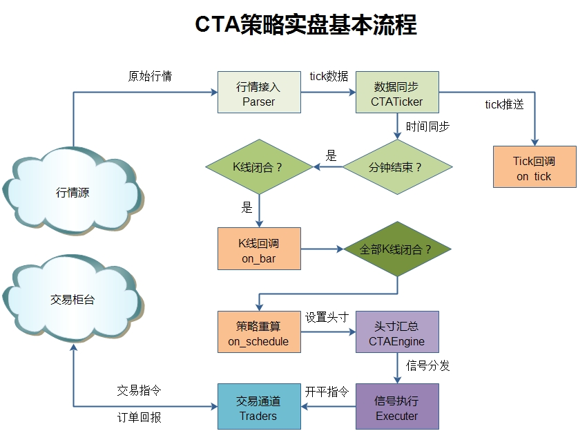
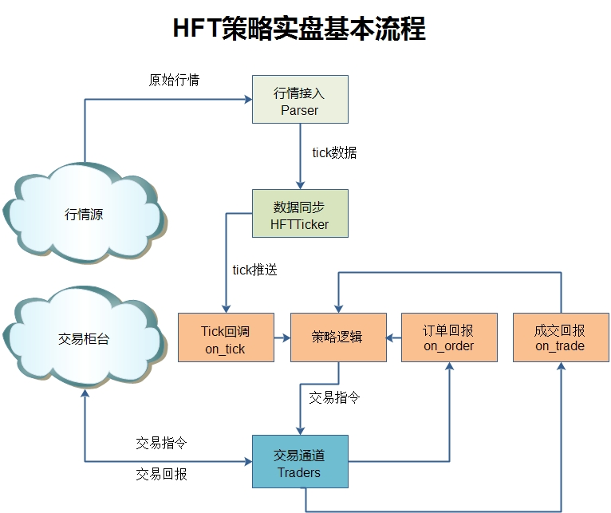

# HFT策略编写及回测

## 多引擎设计
WonderTrader采用多引擎设计，针对不同类型的策略提供独立的引擎，目前支持的引擎包括：
    
- **CTA引擎**，也叫**同步策略引擎**，一般适用于标的较少，计算逻辑较快的策略，事件+时间驱动。典型的应用场景包括单标的择时、中频以下的套利等。Demo中提供的DualThrust策略，单次重算平均耗时，Python实现版本约70多微秒，C++实现版本约4.5微秒。

- **SEL引擎**，也叫**异步策略引擎**，一般适用于标的较多，计算逻辑耗时较长的策略，时间驱动。典型应用场景包括多因子选股策略、截面多空策略等。
- **HFT引擎**，也叫**高频策略引擎**，主要针对高频或者低延时策略，事件驱动，**系统延迟在1微秒之内**
- **UFT引擎**，也叫**极速策略引擎**，主要针对超高频或者超低延时策略，事件驱动，**系统延迟在200纳秒之内**



## HFT策略概述

要基于WonderTrader实现HFT策略，有两种方式：
- 基于wtcpp，直接使用纯C++开发策略。这种方式适合有较高C++编程能力，并且对延迟有较高要求的用户
- 基于wtpy，使用python开发策略。这种方式适合对延迟有要求但是不是特别敏感，对C++也不大熟悉的用户

无论哪种方式，底层都是纯C++实现，执行效率有保障。HFT引擎和CTA引擎的最大区别在于：
- HFT引擎中策略直接和交易接口绑定，交易接口的回报直接推送给策略，策略需要自行维护订单。
- CTA引擎中，策略信号和执行是彻底剥离的，CTA引擎可以和多个执行器对接，从而实现一个组合对接多个交易通道的机制。更多信息可以参考**WonderTrader的M+1+N的执行架构**。

## HFT策略接口

和CTA策略一样，HFT策略也有一个基础结构：
```python
class BaseHftStrategy:
    '''
    HFT策略基础类，所有的策略都从该类派生
    包含了策略的基本开发框架
    '''
    def __init__(self, name:str):
        self.__name__ = name
        
    
    def name(self) -> str:
        return self.__name__


    def on_init(self, context:HftContext):
        '''
        策略初始化，启动的时候调用
        用于加载自定义数据

        @context    策略运行上下文
        '''
        return
    
    def on_session_begin(self, context:HftContext, curTDate:int):
        '''
        交易日开始事件

        @curTDate   交易日，格式为20210220
        '''
        return

    def on_session_end(self, context:HftContext, curTDate:int):
        '''
        交易日结束事件

        @curTDate   交易日，格式为20210220
        '''
        return

    def on_backtest_end(self, context:CtaContext):
        '''
        回测结束时回调，只在回测框架下会触发

        @context    策略上下文
        '''
        return

    def on_tick(self, context:HftContext, stdCode:str, newTick:dict):
        '''
        Tick数据进来时调用

        @context    策略运行上下文
        @stdCode    合约代码
        @newTick    最新Tick
        '''
        return

    def on_order_detail(self, context:HftContext, stdCode:str, newOrdQue:dict):
        '''
        逐笔委托数据进来时调用

        @context    策略运行上下文
        @stdCode    合约代码
        @newOrdQue  最新逐笔委托
        '''
        return

    def on_order_queue(self, context:HftContext, stdCode:str, newOrdQue:dict):
        '''
        委托队列数据进来时调用

        @context    策略运行上下文
        @stdCode    合约代码
        @newOrdQue  最新委托队列
        '''
        return

    def on_transaction(self, context:HftContext, stdCode:str, newTrans:dict):
        '''
        逐笔成交数据进来时调用

        @context    策略运行上下文
        @stdCode    合约代码
        @newTrans   最新逐笔成交
        '''
        return

    def on_bar(self, context:HftContext, stdCode:str, period:str, newBar:dict):
        '''
        K线闭合时回调

        @context    策略上下文
        @stdCode    合约代码
        @period     K线周期
        @newBar     最新闭合的K线
        '''
        return

    def on_channel_ready(self, context:HftContext):
        '''
        交易通道就绪通知

        @context    策略上下文
        '''
        return

    def on_channel_lost(self, context:HftContext):
        '''
        交易通道丢失通知

        @context    策略上下文
        '''
        return

    def on_entrust(self, context:HftContext, localid:int, stdCode:str, bSucc:bool, msg:str, userTag:str):
        '''
        下单结果回报

        @context    策略上下文
        @localid    本地订单id
        @stdCode    合约代码
        @bSucc      下单结果
        @mes        下单结果描述
        '''
        return

    def on_order(self, context:HftContext, localid:int, stdCode:str, isBuy:bool, totalQty:float, leftQty:float, price:float, isCanceled:bool, userTag:str):
        '''
        订单回报
        @context    策略上下文
        @localid    本地订单id
        @stdCode    合约代码
        @isBuy      是否买入
        @totalQty   下单数量
        @leftQty    剩余数量
        @price      下单价格
        @isCanceled 是否已撤单
        '''
        return

    def on_trade(self, context:HftContext, localid:int, stdCode:str, isBuy:bool, qty:float, price:float, userTag:str):
        '''
        成交回报

        @context    策略上下文
        @stdCode    合约代码
        @isBuy      是否买入
        @qty        成交数量
        @price      成交价格
        '''
        return

    def on_position(self, context:HftContext, stdCode:str, isLong:bool, prevol:float, preavail:float, newvol:float, newavail:float):
        '''
        初始持仓回报
        实盘可用, 回测的时候初始仓位都是空, 所以不需要

        @context    策略上下文
        @stdCode    合约代码
        @isLong     是否为多
        @prevol     昨仓
        @preavail   可用昨仓
        @newvol     今仓
        @newavail   可用今仓
        '''
        return
```
从上面的代码可以看出，整个策略的结构大致可以分为四块：
* 策略本身的回调
* 行情数据的回调
* 交易通道的回调
* 交易回报的回调

其中行情数据的回调，主要包括`on_tick`、`on_bar`和`level2`数据回调，本文中只需要关注`on_tick`即可；交易通道的回调，主要是通知策略交易通道的连接和断开事件；交易回报的回调，主要是订单回报、成交回报以及下单回报。

HftContext提供了相应的各种接口，更多信息可以参考API相关文档的介绍。

## 一个简单的HFT策略
wtpy的demo中提供了一个简单的HFT策略，大致逻辑就是利用最新的tick计算一个理论价格，然后比较最新价和理论价格的大小，再生成交易信号。

```py
from wtpy import BaseHftStrategy
from wtpy import HftContext

from datetime import datetime

def makeTime(date:int, time:int, secs:int):
    '''
    将系统时间转成datetime\n
    @date   日期，格式如20200723\n
    @time   时间，精确到分，格式如0935\n
    @secs   秒数，精确到毫秒，格式如37500
    '''
    return datetime(year=int(date/10000), month=int(date%10000/100), day=date%100, 
        hour=int(time/100), minute=time%100, second=int(secs/1000), microsecond=secs%1000*1000)

class HftStraDemo(BaseHftStrategy):

    def __init__(self, name:str, code:str, expsecs:int, offset:int, freq:int=30):
        BaseHftStrategy.__init__(self, name)

        '''交易参数'''
        self.__code__ = code            #交易合约
        self.__expsecs__ = expsecs      #订单超时秒数
        self.__offset__ = offset        #指令价格偏移
        self.__freq__ = freq            #交易频率控制，指定时间内限制信号数，单位秒

        '''内部数据'''
        self.__last_tick__ = None       #上一笔行情
        self.__orders__ = dict()        #策略相关的订单
        self.__last_entry_time__ = None #上次入场时间
        self.__cancel_cnt__ = 0         #正在撤销的订单数
        self.__channel_ready__ = False  #通道是否就绪
        

    def on_init(self, context:HftContext):
        '''
        策略初始化，启动的时候调用\n
        用于加载自定义数据\n
        @context    策略运行上下文
        '''

        #先订阅实时数据
        context.stra_sub_ticks(self.__code__)

        self.__ctx__ = context

    def check_orders(self):
        #如果未完成订单不为空
        if len(self.__orders__.keys()) > 0 and self.__last_entry_time__ is not None:
            #当前时间，一定要从api获取，不然回测会有问题
            now = makeTime(self.__ctx__.stra_get_date(), self.__ctx__.stra_get_time(), self.__ctx__.stra_get_secs())
            span = now - self.__last_entry_time__
            if span.total_seconds() > self.__expsecs__: #如果订单超时，则需要撤单
                for localid in self.__orders__:
                    self.__ctx__.stra_cancel(localid)
                    self.__cancel_cnt__ += 1
                    self.__ctx__.stra_log_text("cancelcount -> %d" % (self.__cancel_cnt__))

    def on_tick(self, context:HftContext, stdCode:str, newTick:dict):
        if self.__code__ != stdCode:
            return

        #如果有未完成订单，则进入订单管理逻辑
        if len(self.__orders__.keys()) != 0:
            self.check_orders()
            return

        if not self.__channel_ready__:
            return

        self.__last_tick__ = newTick

        #如果已经入场，则做频率检查
        if self.__last_entry_time__ is not None:
            #当前时间，一定要从api获取，不然回测会有问题
            now = makeTime(self.__ctx__.stra_get_date(), self.__ctx__.stra_get_time(), self.__ctx__.stra_get_secs())
            span = now - self.__last_entry_time__
            if span.total_seconds() <= 30:
                return

        #信号标志
        signal = 0
        #最新价作为基准价格
        price = newTick["price"]
        #计算理论价格
        pxInThry = (newTick["bid_price_0"]*newTick["ask_qty_0"] + newTick["ask_price_0"]*newTick["bid_qty_0"]) / (newTick["ask_qty_0"] + newTick["bid_qty_0"])

        context.stra_log_text("理论价格%f，最新价：%f" % (pxInThry, price))

        if pxInThry > price:    #理论价格大于最新价，正向信号
            signal = 1
            context.stra_log_text("出现正向信号")
        elif pxInThry < price:  #理论价格小于最新价，反向信号
            signal = -1
            context.stra_log_text("出现反向信号")

        if signal != 0:
            #读取当前持仓
            curPos = context.stra_get_position(self.__code__)
            #读取品种属性，主要用于价格修正
            commInfo = context.stra_get_comminfo(self.__code__)
            #当前时间，一定要从api获取，不然回测会有问题
            now = makeTime(self.__ctx__.stra_get_date(), self.__ctx__.stra_get_time(), self.__ctx__.stra_get_secs())

            #如果出现正向信号且当前仓位小于等于0，则买入
            if signal > 0 and curPos <= 0:
                #买入目标价格=基准价格+偏移跳数*报价单位
                targetPx = price + commInfo.pricetick * self.__offset__

                #执行买入指令，返回所有订单的本地单号
                ids = context.stra_buy(self.__code__, targetPx, 1, "buy")

                #将订单号加入到管理中
                for localid in ids:
                    self.__orders__[localid] = localid
                
                #更新入场时间
                self.__last_entry_time__ = now

            #如果出现反向信号且当前持仓大于等于0，则卖出
            elif signal < 0 and curPos >= 0:
                #买入目标价格=基准价格-偏移跳数*报价单位
                targetPx = price - commInfo.pricetick * self.__offset__

                #执行卖出指令，返回所有订单的本地单号
                ids = context.stra_sell(self.__code__, targetPx, 1, "sell")

                #将订单号加入到管理中
                for localid in ids:
                    self.__orders__[localid] = localid
                
                #更新入场时间
                self.__last_entry_time__ = now


    def on_bar(self, context:HftContext, stdCode:str, period:str, newBar:dict):
        return

    def on_channel_ready(self, context:HftContext):
        undone = context.stra_get_undone(self.__code__)
        if undone != 0 and len(self.__orders__.keys()) == 0:
            context.stra_log_text("%s存在不在管理中的未完成单%f手，全部撤销" % (self.__code__, undone))
            isBuy = (undone > 0)
            ids = context.stra_cancel_all(self.__code__, isBuy)
            for localid in ids:
                self.__orders__[localid] = localid
            self.__cancel_cnt__ += len(ids)
            context.stra_log_text("cancelcnt -> %d" % (self.__cancel_cnt__))
        self.__channel_ready__ = True

    def on_channel_lost(self, context:HftContext):
        context.stra_log_text("交易通道连接丢失")
        self.__channel_ready__ = False

    def on_entrust(self, context:HftContext, localid:int, stdCode:str, bSucc:bool, msg:str, userTag:str):
        if bSucc:
            context.stra_log_text("%s下单成功，本地单号：%d" % (stdCode, localid))
        else:
            context.stra_log_text("%s下单失败，本地单号：%d，错误信息：%s" % (stdCode, localid, msg))

    def on_order(self, context:HftContext, localid:int, stdCode:str, isBuy:bool, totalQty:float, leftQty:float, price:float, isCanceled:bool, userTag:str):
        if localid not in self.__orders__:
            return

        if isCanceled or leftQty == 0:
            self.__orders__.pop(localid)
            if self.__cancel_cnt__ > 0:
                self.__cancel_cnt__ -= 1
                self.__ctx__.stra_log_text("cancelcount -> %d" % (self.__cancel_cnt__))
        return

    def on_trade(self, context:HftContext, localid:int, stdCode:str, isBuy:bool, qty:float, price:float, userTag:str):
        return
```

更多HFT相关信息可以参考wtpy/demos/hft_fut，也可以参考专栏文章[WonderTrader高频交易初探及v0.6发布](https://zhuanlan.zhihu.com/p/349167970)。
