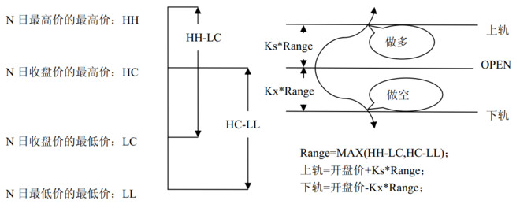
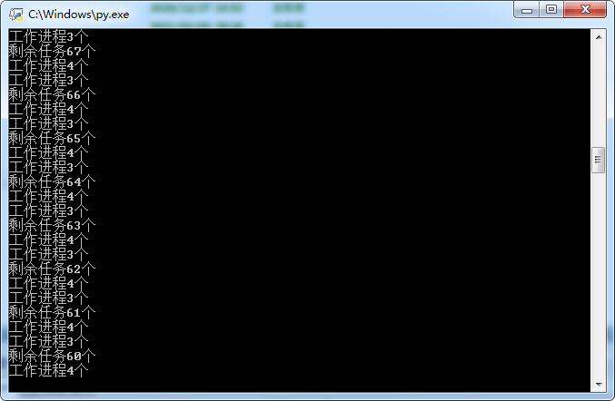
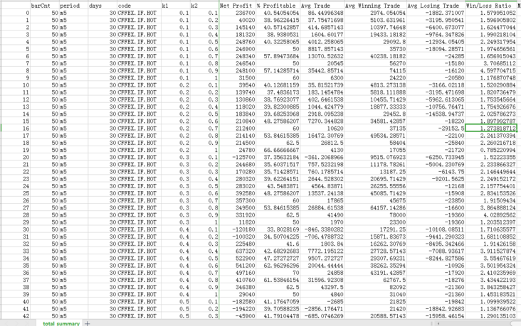
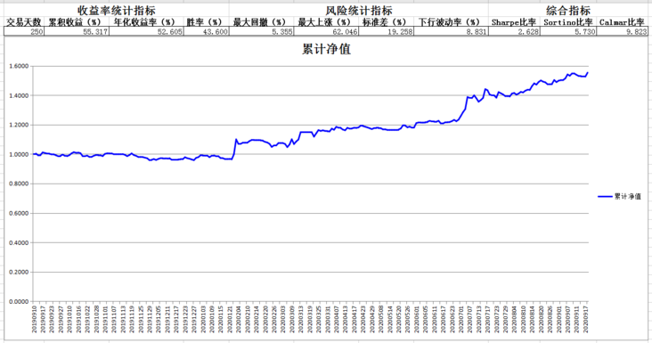
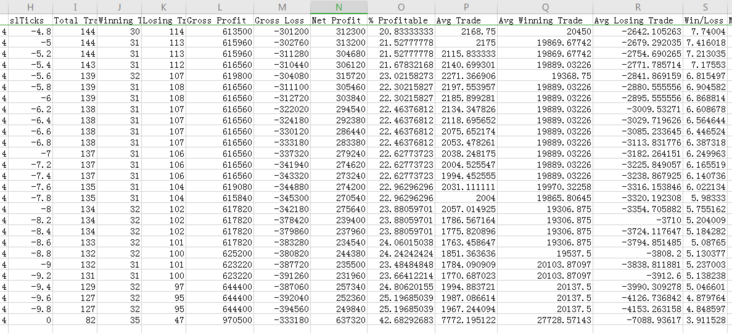
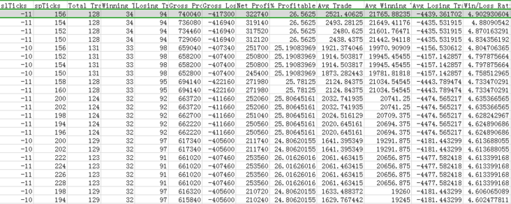
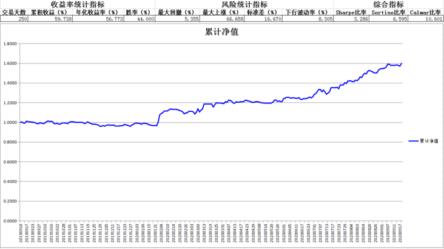

# 优化自己的策略

### 参数优化器简介
---
`wtpy`针对**CTA策略**写了一个参数优化器**WtCtaOptimizer**，该模块主要通过**遍历参数**的方式，利用**multiprocessing**模块**并发启动多个进程**进行**历史回测**，然后汇总回测结果生成回测报表。
参数优化器主要支持以下几种参数类型：
* **固定参数**，即遍历的时候不需要更改的参数
```py
optimizer.add_fixed_param(name="barCnt", val=50)
```
* **数值类可变参数**，即通过设置步长和数值范围进行参数遍历，绝大多数参数都是这个类型
```py
optimizer.add_mutable_param(name="k1", start_val=0.1, end_val=1.0, step_val=0.1, ndigits = 1)
```
* **列表类可变参数**，即给定预设的列表，进行参数选择，一般用于遍历标的、周期等参数
```py
optimizer.add_listed_param(name="code", val_list=["CFFEX.IF.HOT","CFFEX.IC.HOT"])
```

### DualThrust介绍
---
首先我们还是祭出**WonderTrader**惯用的`DualThrust`策略。

`DualThrust`策略是一个突破策略，利用前N日的开高低收确定一个`Range`，然后利用当前K线的开盘价加上`Range`乘以一个系数得到一个上轨，减去`Range`乘以一个系数得到一个下轨，当最新价突破上轨时做多，突破下轨时做空。



`DualThrust`原模型中，上下轨是对称的，文本所用的`DualThrust`策略在实现时把上下轨的系数作为两个不同的参数，策略核心逻辑如下：

```py
def on_calculate(self, context:CtaContext):
    code = self.__code__    #品种代码

    trdUnit = 1

    #读取最近50条1分钟线(dataframe对象)
    theCode = code
    df_bars = context.stra_get_bars(theCode, self.__period__, self.__bar_cnt__, isMain = True)

    #把策略参数读进来，作为临时变量，方便引用
    days = self.__days__
    k1 = self.__k1__
    k2 = self.__k2__

    #平仓价序列、最高价序列、最低价序列
    closes = df_bars.closes
    highs = df_bars.highs
    lows = df_bars.lows

    #读取days天之前到上一个交易日位置的数据
    hh = np.amax(highs[-days:-1])
    hc = np.amax(closes[-days:-1])
    ll = np.amin(lows[-days:-1])
    lc = np.amin(closes[-days:-1])

    #读取今天的开盘价、最高价和最低价
    # lastBar = df_bars.get_last_bar()
    openpx = df_bars.opens[-1]
    highpx = df_bars.highs[-1]
    lowpx = df_bars.lows[-1]

    '''
    !!!!!这里是重点
    1、首先根据最后一条K线的时间，计算当前的日期
    2、根据当前的日期，对日线进行切片,并截取所需条数
    3、最后在最终切片内计算所需数据
    '''

    #确定上轨和下轨
    upper_bound = openpx + k1* max(hh-lc,hc-ll)
    lower_bound = openpx - k2* max(hh-lc,hc-ll)

    #读取当前仓位
    curPos = context.stra_get_position(code)/trdUnit

    if curPos == 0:
        if highpx >= upper_bound:
            context.stra_enter_long(code, 1*trdUnit, 'enterlong')
            context.stra_log_text("向上突破%.2f>=%.2f，多仓进场" % (highpx, upper_bound))
            return

        if lowpx <= lower_bound and not self.__is_stk__:
            context.stra_enter_short(code, 1*trdUnit, 'entershort')
            context.stra_log_text("向下突破%.2f<=%.2f，空仓进场" % (lowpx, lower_bound))
            return
    elif curPos > 0:
        if lowpx <= lower_bound:
            context.stra_exit_long(code, 1*trdUnit, 'exitlong')
            context.stra_log_text("向下突破%.2f<=%.2f，多仓出场" % (lowpx, lower_bound))
            return
    else:
        if highpx >= upper_bound and not self.__is_stk__:
            context.stra_exit_short(code, 1*trdUnit, 'exitshort')
            context.stra_log_text("向上突破%.2f>=%.2f，空仓出场" % (highpx, upper_bound))
            return
```

### 初步回测
---
策略准备好了，我们先针对`DualThrust`不加止盈止损的绩效进行一个最优参数选择。参数优化器的调用代码如下：
```py
from wtpy.apps import WtCtaOptimizer

from Strategies.DualThrust import StraDualThrust

if __name__ == "__main__":
    # 新建一个优化器，并设置最大工作进程数为8
    optimizer = WtCtaOptimizer(worker_num=4)

    # 设置要使用的策略，只需要传入策略类型即可，同时设置策略ID的前缀，用于区分每个策略的实例
    optimizer.set_strategy(StraDualThrust, "Dt_IF_")

    # 添加固定参数
    optimizer.add_fixed_param(name="barCnt", val=50)
    optimizer.add_fixed_param(name="period", val="m5")
    optimizer.add_fixed_param(name="days", val=30)
    optimizer.add_fixed_param(name="code", val="CFFEX.IF.HOT")

    # 添加预设范围的参数，即参数只能在预设列表中选择，适用于标的代码、周期等参数
    # optimizer.add_listed_param(name="code", val_list=["CFFEX.IF.HOT","CFFEX.IC.HOT"])

    # 添加可变参数，适用于一般数值类参数
    optimizer.add_mutable_param(name="k1", start_val=0.1, end_val=1.0, step_val=0.1, ndigits = 1)
    optimizer.add_mutable_param(name="k2", start_val=0.1, end_val=1.0, step_val=0.1, ndigits = 1)

    # 配置回测环境，主要是将直接回测的一些参数通过这种方式动态传递，优化器中会在每个子进程动态构造回测引擎
    optimizer.config_backtest_env(deps_dir='./common/', cfgfile='configbt.json', storage_type="csv", storage_path="./storage/")
    optimizer.config_backtest_time(start_time=201909100930, end_time=202010121500)

    # 启动优化器
    optimizer.go(interval=0.2, out_marker_file="strategies.json")

    kw = input('press any key to exit\n')

```
本例中设置工作进程的个数为4个，用户可以自行根据自己的需求设置，一般推荐设置的个数和`CPU`内核数匹配。
优化器入口配置好了，就可以启动回测了。

**优化器执行界面**



**系统资源占用情况**


优化器批量回测完成以后，我们可以得到一个汇总报表



我们先按照**收益风险比大于3**，进行初步筛选。


最终我们选择交易次数最多的一个参数对，即k1和k2都等于0.4这组，作为我们最基础的策略参数。先利用**WtBtAnalyst**做一下绩效分析，2019年股指期货大概在4000点左右，合约价值大概120万，按照一倍杠杆，设置初始资金为120万。



从绩效来看，这组参数还是很有潜力的。**至于本例是否涉及到过拟合、是否要需要进行样本外数据的回测，这不是本文探讨的范畴**。从绩效分析上来看，**年化收益率**达到了**52.6%**，但是最大回撤只有**5.36%**。

### 加入止损
---
基本参数组合已经确定了，接下来我们要加入止损逻辑。为了简化逻辑，我们采用**固定价差止损**的方式，并且在策略进出场逻辑之前进行判断。止损的计算方式采用最新价和进场价的价差，当价差达到一定点位，则进行止损。
我们将止损点位区间设置为0到10，每次0.2一跳。代码如下：
```py
def runStopLossOptimizer():
    # 新建一个优化器，并设置最大工作进程数为8
    optimizer = WtCtaOptimizer(worker_num=4)

    # 设置要使用的策略，只需要传入策略类型即可，同时设置策略ID的前缀，用于区分每个策略的实例
    optimizer.set_strategy(StraDualThrust, "Dt_IF_SL_")

    # 添加固定参数
    optimizer.add_fixed_param(name="barCnt", val=50)
    optimizer.add_fixed_param(name="period", val="m5")
    optimizer.add_fixed_param(name="days", val=30)
    optimizer.add_fixed_param(name="code", val="CFFEX.IF.HOT")
    optimizer.add_fixed_param(name="k1", val=0.4)
    optimizer.add_fixed_param(name="k2", val=0.4)

    # 添加可变参数，适用于一般数值类参数
    optimizer.add_mutable_param(name="slTicks", start_val=0, end_val=10, step_val=0.2, ndigits = 1)

    # 配置回测环境，主要是将直接回测的一些参数通过这种方式动态传递，优化器中会在每个子进程动态构造回测引擎
    optimizer.config_backtest_env(deps_dir='./common/', cfgfile='configbt.json', storage_type="csv", storage_path="./storage/")
    optimizer.config_backtest_time(start_time=201909100930, end_time=202010121500)

    # 启动优化器
    optimizer.go(interval=0.2, out_marker_file="strategies.json",out_summary_file="total_summary.csv")
```
汇总的回测结果如下。通过简单的分析，我们不难发现，虽然设置止损以后，对提高**收益风险比**有很大的促进，最大的是-0.2点止损，**收益风险比**可以达到**17倍**以上。但是付出的代价就是总收益的下降，设置了止损点以后，最终**净收益**比未设置止损点的时候，**少了约30万到40万，约为原来的1/3到1/2**。



### 加入止盈
---
下面我们再来看一下止盈逻辑。本文为了简化逻辑，采用**固定点位止盈**。
为了锁定更多利润，我们将止盈点的范围设置为0~500，每次5.0一跳。代码如下：

```py
def runStopProfOptimizer():
    # 新建一个优化器，并设置最大工作进程数为8
    optimizer = WtCtaOptimizer(worker_num=4)

    # 设置要使用的策略，只需要传入策略类型即可，同时设置策略ID的前缀，用于区分每个策略的实例
    optimizer.set_strategy(StraDualThrust, "Dt_IF_SP_")

    # 添加固定参数
    optimizer.add_fixed_param(name="barCnt", val=50)
    optimizer.add_fixed_param(name="period", val="m5")
    optimizer.add_fixed_param(name="days", val=30)
    optimizer.add_fixed_param(name="code", val="CFFEX.IF.HOT")
    optimizer.add_fixed_param(name="k1", val=0.4)
    optimizer.add_fixed_param(name="k2", val=0.4)

    # 添加可变参数，适用于一般数值类参数
    optimizer.add_mutable_param(name="spTicks", start_val=0, end_val=500, step_val=5, ndigits = 1)

    # 配置回测环境，主要是将直接回测的一些参数通过这种方式动态传递，优化器中会在每个子进程动态构造回测引擎
    optimizer.config_backtest_env(deps_dir='./common/', cfgfile='configbt.json', storage_type="csv", storage_path="./storage/")
    optimizer.config_backtest_time(start_time=201909100930, end_time=202010121500)

    # 启动优化器
    optimizer.go(interval=0.2, out_marker_file="strategies.json",out_summary_file="total_summary_sp.csv")
```
我们将汇总的结果中**收益风险比大于4**的截取出来，如下图：


由上图可以见，止盈逻辑对策略绩效的提升还是比较明显的，但是**当止盈点位在150点到230之间，收益风险比基本上达到稳定**，策略绩效提升约10%以上。

### 完整回测
---
实际使用中，止盈止损当然不可能分为两个互相独立的逻辑来使用，反而是配合使用的。所以我们最后再将止盈止损的参数进行联合优化。
根据上面的回测结果，我们将**止盈点位的范围控制在150到230之间，止损点位控制在-30到-10之间**。代码如下：
```py
def runStopAllOptimizer():
    # 新建一个优化器，并设置最大工作进程数为8
    optimizer = WtCtaOptimizer(worker_num=4)

    # 设置要使用的策略，只需要传入策略类型即可，同时设置策略ID的前缀，用于区分每个策略的实例
    optimizer.set_strategy(StraDualThrust, "Dt_IF_ALL_")

    # 添加固定参数
    optimizer.add_fixed_param(name="barCnt", val=50)
    optimizer.add_fixed_param(name="period", val="m5")
    optimizer.add_fixed_param(name="days", val=30)
    optimizer.add_fixed_param(name="code", val="CFFEX.IF.HOT")
    optimizer.add_fixed_param(name="k1", val=0.4)
    optimizer.add_fixed_param(name="k2", val=0.4)

    # 添加可变参数，适用于一般数值类参数
    optimizer.add_mutable_param(name="slTicks", start_val=-30, end_val=-10, step_val=1, ndigits = 1)
    optimizer.add_mutable_param(name="spTicks", start_val=150, end_val=230, step_val=2, ndigits = 1)

    # 配置回测环境，主要是将直接回测的一些参数通过这种方式动态传递，优化器中会在每个子进程动态构造回测引擎
    optimizer.config_backtest_env(deps_dir='./common/', cfgfile='configbt.json', storage_type="csv", storage_path="./storage/")
    optimizer.config_backtest_time(start_time=201909100930, end_time=202010121500)

    # 启动优化器
    optimizer.go(interval=0.2, out_marker_file="strategies.json",out_summary_file="total_summary_all.csv")
```
回测结果汇总表如下：



从上图可以看出来，止盈止损完整的逻辑，对于提高收益风险比还是有提升的，但是净利润还是会比无止盈止损的时候降低不少。
我们再选择收益风险比最高的一组参数，看一下策略的绩效分析。


最大回撤并没有比无止盈止损的逻辑低，反而直接损失了收益率。
我们最后再看一下只有止盈逻辑的最优参数的绩效分析。



综合上面我们可以看出来，止损逻辑并没有对策略绩效有比较正向的改善，反而止盈逻辑能锁定不少原本要回吐的利润。止损无效的原因何在，可能是因为止损点位的范围设置不合理，或者是因为别的原因，这个就不在本文的讨论范围了，有兴趣的读者可以自行研究一下。